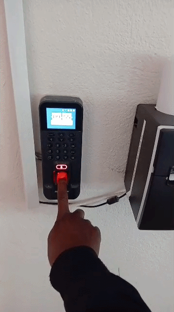

# Biometric MealSlips


-red)

**Real-time meal slip printing for Hikvision biometric devices**

---

## 📋 Project Overview

This system automatically prints meal slips at the Boys’ and Girls’ canteens when students or staff scan at designated Hikvision devices.

- Only the two canteen devices (by serial number) trigger printing.
- All other devices authenticate normally but do **not** print.
- Fully integrated with Ed-Admin

Part of the **Educore Services Biometric Integration Project** (December 2024) delivered by **Unzima Technologies**.

---

## ✨ Key Features

- Serial-based printing policy (safe for shared database)
- Cross-platform (Windows + Linux)
- Real-time HTTP webhook from HikCentral
- Robust retry logic and automatic DB reconnection
- Atomic print marking to prevent duplicates
- Configurable via `.env` file

---

## 🏗️ Architecture
HikCentral → HTTP POST → HikEventReceiver
↓
attlog table (SQL Server)
↓
MealSlipService (polling worker)
↓
Network Printer (canteen only)
text---

## 🚀 Quick Start

```bash
git clone https://github.com/YOUR-ORG/trident-mealslip-printer.git
cd trident-mealslip-printer

python -m venv venv
source venv/bin/activate          # Linux/macOS
# venv\Scripts\activate           # Windows

pip install -r requirements.txt
cp config.example.env .env
# Edit .env with your settings
Run both services:
Bashpython main_receiver.py   # Terminal 1
python main_printer.py    # Terminal 2
```
## 🛠️ Developer / Technical Notes

Two independent services:
main_receiver.py – Receives HikCentral events and calls sp_InsertAttLog
main_printer.py – Polls attlog table and prints using policy

Uses your existing index IX_attlog_meal_queue
Printers identified by shared name (Windows) or CUPS queue name (Linux)
Logging to logs/mealslip.log


## 📋 Configuration
Copy config.example.env → .env and update:

Database credentials
DEVICE_PRINT_POLICY_SERIAL (canteen device serials)
DEVICE_PRINT_POLICY_NAME (fallback device names)


## 📦 Deployment
Linux (systemd)
Bashsudo cp linux_service/*.service /etc/systemd/system/
sudo systemctl daemon-reload
sudo systemctl enable --now mealslip-receiver mealslip-printer
Windows
Use NSSM or install via windows_services.py (available on request).

## 🔧 HikCentral Setup

Configuration → Event → Notification → Add
Set:
URL: http://YOUR-SERVER-IP:5000/hik-event
Method: POST
Event Type: AcsEvent


## 📜 License
This software is proprietary and licensed under the End User License Agreement (EULA).
Commercial use, redistribution, or deployment outside of Trident College / Educore Services is strictly prohibited without written permission from Unzima Technologies.

📞 Support
Unzima Technologies
A subsidiary of Unzima Investments
Lusaka, Zambia
For support or modifications, contact project manager.

© 2024 Unzima Technologies. All Rights Reserved.
